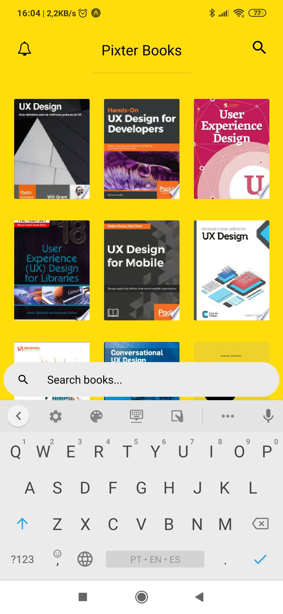

# PIXTER BOOKS

**Pixter Books** is an app that lists books according to the user searchs, and always notify whenever there is a book store within 400 meters.

### Tech & Integrations

- React Native Expo
- Google Books API
- Google Places API
- Redux & Redux Saga
- Push Notifications

### Screens

  
  
  
  

